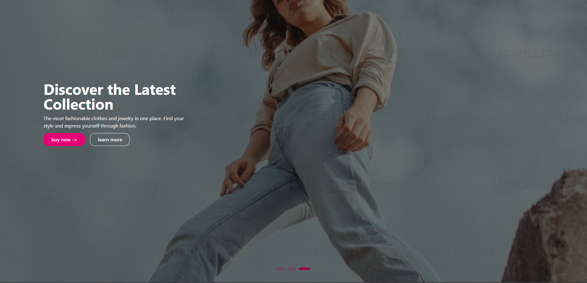
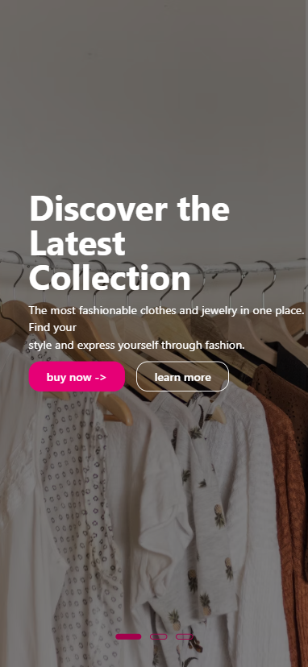
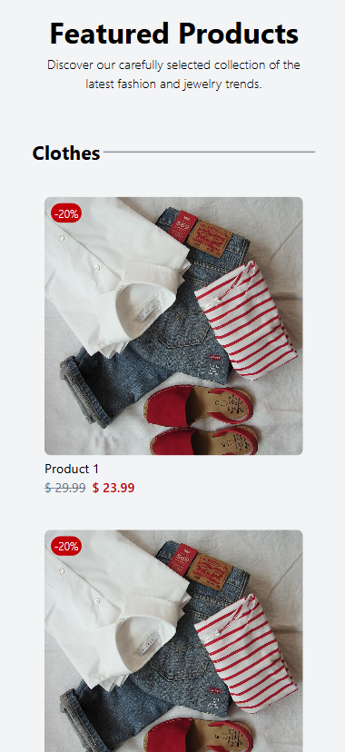

# 🛍️ Shop Page (CooShop)

## 🚀 Demo

### 👉 [See the live demo here](https://cooshop.netlify.app/)

## 🛣️ Roadmap

### ✅ Setup project structure (Vite, TailwindCSS, React)

### ✅ Build initial Landing Page

### ✅ Implement animations with Framer Motion

### ✅ Ensure Responsive Design (Desktop / Tablet / Mobile)

### ✅ Create Product Detail Page

### ✅ Deploy the project to production (Netlify)

#### Connect to external API (products, authentication)

#### Create Product Listing Page

#### Develop Shopping Cart functionality

#### Add Login and Authentication system

#### Implement Loading and Error States

#### Optimize performance and accessibility

## 🛠️ Technologies Used

## 🖼️ Project Visualization

#### Header Desktop

#### Header Mobile

#### Featured Products

#### [Mobile.pdf](File/Mobile.pdf)

#### [PC.pdf](File/PC.pdf)

## 📌 Notes

##### This project is still in progress – functionality and design might change.

##### Some features (e.g., full registration system, checkout process) may be added later.
